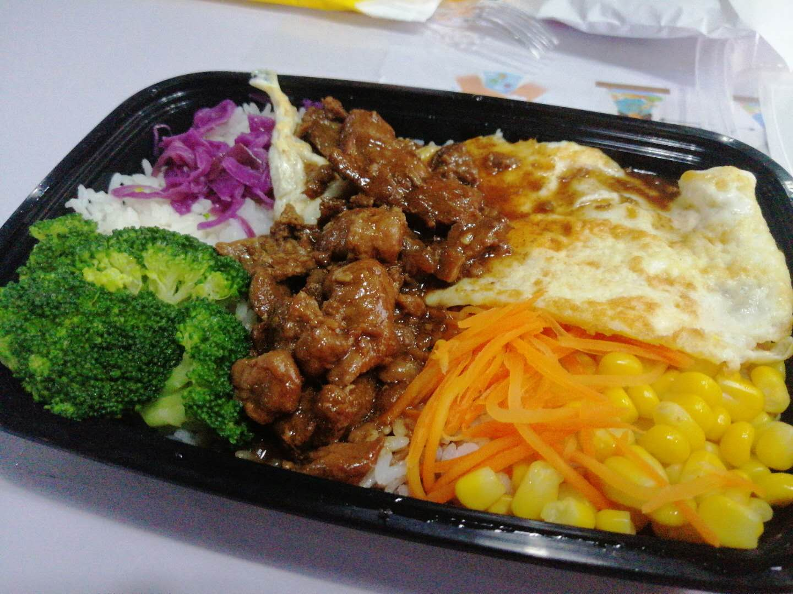
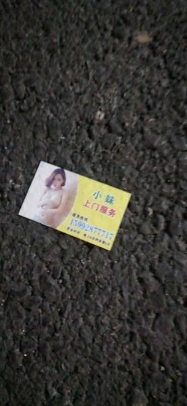
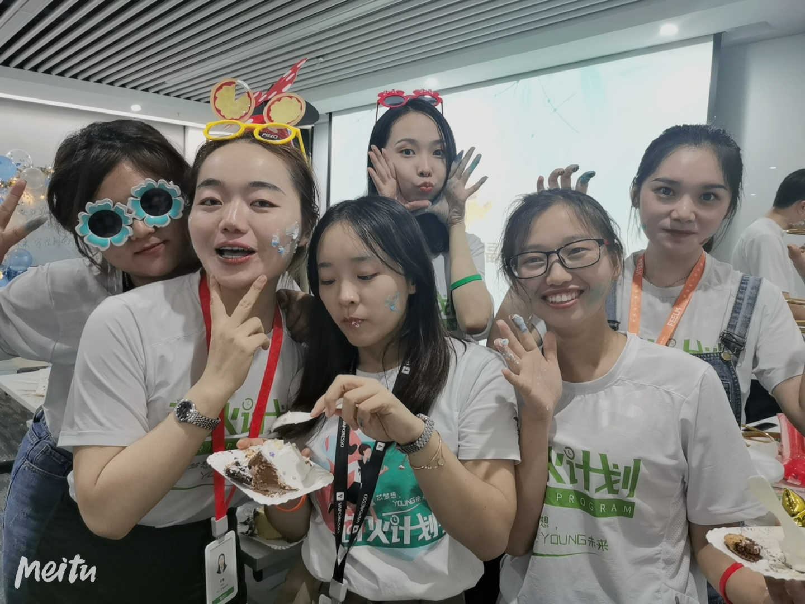
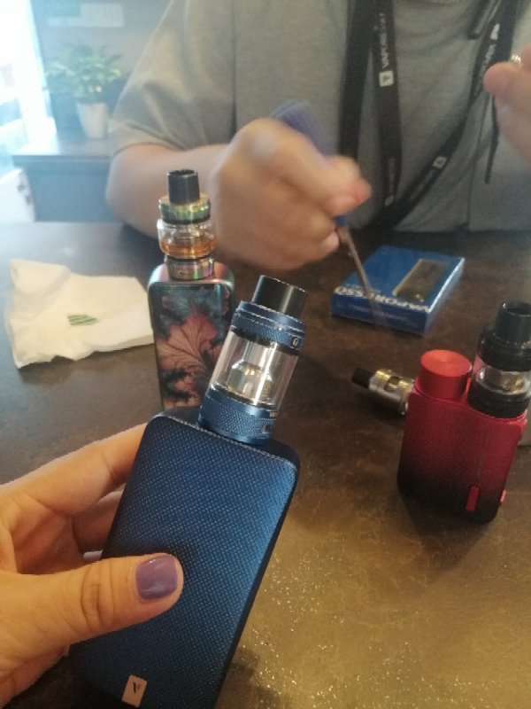
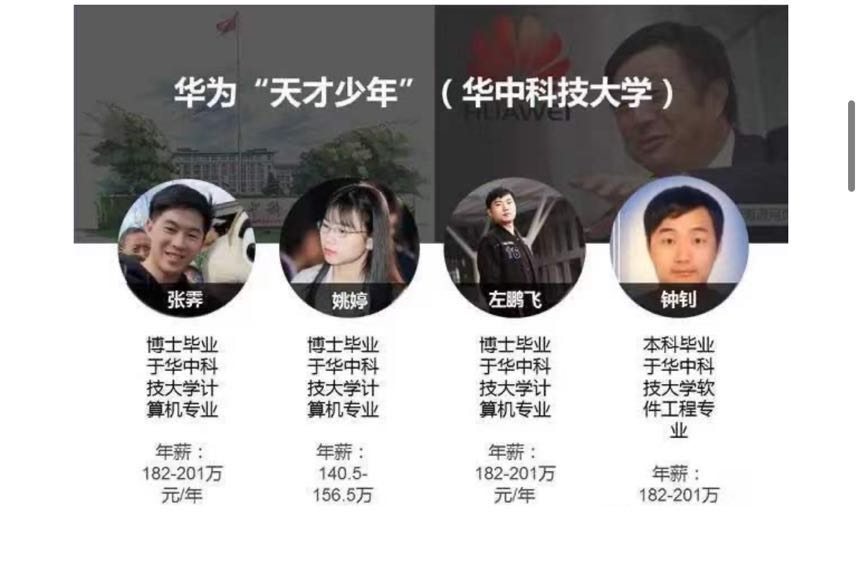

# 姑且diary
0803 今天算是吨吨上班去公司第一天，虽然昨天就到了。吨吨早上起床的时候说很开心，吃到了10来年前的肠粉，味道都很棒。但是晚饭挺一般的，因为没啥味道，我估计得给吨吨整点老干妈呀

0804 吨吨今天超级挺累的，中午去的公司，然后开了一下午会议，肚子还疼。到了晚上还在彩排一些流程。结果需要用mac剪视频，然鹅macos突然进不去了，尴尬阿，我们搞了很久，option之类都不行。在win下面查看bootcamp看不到macos的。吨吨真的累坏了，希望能通过大佬的处理掉

0805 今天吨吨开始培训，7点就去了。。。真的猛阿，我这边早上突然台风带来暴雨，我硬生生走路45mins到了公司。路漫漫阿。吨吨上午还给我发辽培训时候的几张图，关于电子烟的，你可得好好记阿。然后中午是居然2点才上班，酸了。下午我把其中一个trackpad卖掉了开心。 今天一天都在搞订阅的分享页面。因为遮罩层的一个bug，难了我半天，饭也没吃上，我得努力阿，彩笔没话语权的。

0806 今天吨吨貌似又是7点起床，我现在10点了，她依旧没有下班，公司组织的羽毛球比赛？还是活动，拉着她们当裁判，nbnb的，太辛苦了,中午说吃了一个很好吃的肉夹馍非要给我看。今天早上停电了一个多小时，我被永伟大哥拉去谈话，确实毕业第一年挣得钱其实不算什么，我得有职业规划，我的想法，像硬件类的少折腾，浪费时间。提升技能才对。我将魔盒布局拆分开，尝试加入ele的国际化 但失败。哇 吨吨太辛苦了 唉。

0807 早上睁眼居然7点50多了，马上弹射起步刷牙洗脸出门。。吨吨6点就醒了留了言，她也好辛苦，昨晚凌晨才睡，睡眠严重不足，早上公司的活动去惠州，说起来挺辛苦阿，活动很网上那种什么击鼓传花的破冰活动。。。晚上回来路上还要写辩论赛稿子，太累了。现在11点半还在开会。。。

0808 起来的还行，因为今天双休，也放松了一波，很开心，晚上吃了familymart的炸酱面配雪碧，花了8.8，还不错的味道。然后吨吨又是一整天的培训，她说很充实，其实挺假的，所谓充实是自己发自内心驱动填满的充实，而非洗脑后觉得丰富充实。不过企业目的确实到达了，感觉要凉了。

0809 周日了呀，早上吨吨又起的很早，记得昨天她是一点半睡下，深圳都这么猛吗。上午在公司搭建了这个日记的框架，基本实现了家里公司同步更新了，下次调整下样式。下午学习了css第三章，收获颇多，还改了下魔盒的弹框样式。晚上准备弄下述职ppt。

0810 吨吨也上了一周的班了，忙的不可开交系列，周末随随便便都是情侣啊，今天老爸说他要回温州，因为爷爷病了，身体好像不太好，原本我也打算回的，结果这周五我的测评，周六还上班！ 老爸正好也说他先回去看看情况，应该问题不大。吨吨晚上终于可以早些走了， 我们也久违的打了一通电话，然后她还在路上捡到一张小卡片哈哈哈哈。

0811 日记得坚持写，乖乖今天弄生日patry，看起来就很盛大，为数不多的女生，反正日常搞到12点，玩的挺开心的，女生拍照哈哈哈哈真的各个心机大长腿。今天我也搞定些vue的拖拽表格问题，明天多看点css，冲。

0813 今天我搞定了魔盒的机床详情页，知道了新的grid知识，明天仔细看看，晚上还参加了台球比赛，一轮游出局哈哈哈哈。吨吨今天9点就到家了，放的很早，终于可以休息啦，不容易呢。我今天还穿了吨吨亲手缝制的converse，贼拉帅。

0813 哎呀 因为电脑出问题了，赶紧来写，吨吨今天演讲比赛第一名！！！很棒，奖品如下图，哈哈哈哈厉害阿。

今天的话，做的是公众号开发，vue做遮罩层的话，会因为z-index的高度挡住下面元素，所以借助css3的point-events:none属性，使得自己的这个遮罩层失效，下面的元素可以穿透。

0814 哇吨吨今天给我发了她需要做的产品运营，大烟，反正面对的也是国外用户。可她也抽了一下，道理都懂，可以不这样做吗，抖音里那种粗粗的声音就是因为烟抽多了阿，连王菲都不行了。另外华为的薪资，都三天没看css了，不行，明天必须补。今天是我的测评会，我正好卡在魔盒开发这里，这几天必须加班弄好点阿。

​	另外其实淦哥给的建议好的多，代码需要更加规范，不要的东西就丢弃，简洁些。

​	永伟大哥提的，不要拘泥于前端，也不要觉得不会就是理所当然的，不能这样想，我们需要有大局观，做一个优秀的工程师。

    能哥提的，做完东西要及时反馈，注重细节细节！！！

