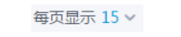

内联元素与流

首先是基线的定义： 
    字母 x 的下沿就是我们的基线。
    
x-height表示的是字母x的高度，然后x上沿的位置称之为midian 中线。

然后vertical-align:middle指的是二分之一的x-height高度。

有一个单位 ex 指的是1个x的高度，这时候有一个应用：

```css
  .icon-arrow{
    display: inline-block;
    width: 20px;
    height: 1ex;     
  }
```

可以看出右边的图标和文字居中，那就只要让图标和字一样高就行了。

div高度其实是由行高 line-height 决定的，而非文字。

对于非替换元素的纯内联元素，视高完全由line-height决定。
border padding完全无影响。

css中，行距等分在文字上下方。

一般认为，行距 = 行高 - em-box

也就是 行距 = line-height - font-size
然后再一分为二。

对于纯文本元素，line-height直接决定了该行的高度

但是如果该行还有替换元素，line-height只决定最小高度。
原因是替换元素高度并不受line-height影响，二是vertical-align的影响

### line-height的居中效果

如果需要让内联元素居中，设置line-height属性就行。此方法只适合单行文字。

多行文字用vertiacl-align配合。

//？line-height的值和字体大小一致即可

另外line-height也并不是完全居中，是近似，原因是上下并不等分，稍微下沉一些。

如果需要 多行文本 或者 替换元素的垂直居中效果，得借助vertical-align

给多行文字设置vertical-align，以出现一个空白幽灵节点,
然后父级再设置line-height使得多行文字或该替换元素垂直居中。

## line-height介绍

default为normal 还支持数值、百分比、长度值。

normal值其实是与字体类型相关的，不同字体font-family的line-height不同

line-height的1.5 150% 1.5em看起来类似,实际上略有区别。

```css
body {
 font-size: 14px;
 line-height: 1.5;
}
body {
 font-size: 14px;
 line-height: 150%;
}
body {
 font-size: 14px;
 line-height: 1.5em;
}
```
这里body的line-height都是21px，但子元素就不一样了
但body里面的子元素影响就不一样了

```css
line-height: 150%;
line-height: 1.5em;
```
这两者的子元素的line-height 是会继承父元素的line-height的。
也就是父元素的21px;
但line-height: 1.5的子元素不会继承，他们的line-height是会乘以当前子元素的font-size的。
所以比较好。

一般布局中，重视图文展示的，比如博客，论坛、公众号这列，最好使用数值，且考虑文章阅读舒适性，
值一般再1.6~1.8之间。

如果是重视布局结构的，使用长度值或者数值都可。
但基本大多网址都是很用数值作为全局line-height。

如果是长度值，建议为line-height:20px(1080p)
如果是数值，建议方便计算，比如1.5

### line-height有一个大值的属性

父子元素都包含line-height时，由两者的大值觉得最终的line-height

## vertical-align

可分为五类:

- 线类 baseline, top, middle, bottom
- 文本类 text-top，text-bottom
- 上标、下标类，sub,super，
- 数值类 如20px, 2em, 
- 百分比 20%

默认值为baseline
对于文字而言，就是字母x的下沿作为基线，故内联元素都是沿着字母x的下沿对齐。
但对于图片这种替换元素，通常使用元素本身的下边缘作为基线。
所以图文并排的时候，文字底端是和图片底端贴着的。
但中文通常还是会比x下沿要低些。

vertical-align 兼容性好，
vertical-align的百分比是基於line-height計算的。 但很少用。
line-height則是基於font-size計算的。

vertical-align是有使用的前提的，即只能应用于内联元素以及display为table-cell的元素。

换而言之，就是display为inline,inline-block,inline-table,table-cell元素才能使用。
默认情况下，span,strong,em等内联元素都ok，img，button，imput等替换元素还有td单元格时支持vertical-align的，
其他块级元素不支持。

但不是说内联元素一定是支持的，假如别的属性偷偷修改了display属性，那元素也就不支持了

```css
.example{
  float: left;
  vertical-align: middle; /* 没有用 */
}

.example{
  position: absolute;
  vertical-align: middle; /* 也没有用 */
}
```

对于字符而言，font-size越大的字符基线就越靠下，因为字母首先都是基于基线对齐的，所以当字号大小不一时，彼此就会发生上下移动；
如果位移足够大，会超过行高的限制。

解决方法也有:
1.将内外的文字都设置为top、bottom、middle对齐，不可基线对齐。
2.修改为较大的line_height
3.修改整行高度，让改行的空白幽灵节点与内部高度一致

#### 常见的图片底部存在由间隙的原因：
- 因为line-height比font-sizze大的存在，使得文字下方必定有一些半行距，而图片是一个替换元素，
基线是自身的下沿。根据定义，默认和基线（x的下沿）对齐，然后字母x下方产生的把半行距放到了图片下方，也就出现了间隙。

解决方法：
- 图片块状化，设置为block，table这种。inline-block没有用。
- 将容器的line-height设置的够小 比如line-height为0
-  容器的font-size足够小，比如font-size为0
- 图片设置其他的vertiacl-align 比如top、bottom、middle之间任意一个。

text-align: justify用于两端对齐的效果。

### vertical-align的线性类属性。

之前说的，对于文本类元素，vertical-align默认值baseline就在字符x的下边缘，
对于替换元素就是替换元素下边缘。
### inline-block
但是，如果是inline-block元素，规则更复杂，一个inline-block元素，如果里面没有内联元素，
或者overflow不是visible，那该元素的基线（baseline）就是margin的底边缘；
否则其基线就是元素里面最后一行内联元素的基线。


inline-block与文字在一起时，需要文字图片在一行
```css
  .icon-line{
    line-height: 20px; // 任意设置，作为图标文字的整体高度，20还算普遍
  }
  .icon-delete{
    background: url("./img/z.png") no-repeat center;
  }
  .icon{
    display: inline-block;
    width: 20px;
    height: 20px; //这里宽高需要和line-height一致，使得水平对齐
    text-indent: -999em;
    white-space: nowrap;
    letter-spacing: -1em;
  }
  i:before{
    content: '/3000'; // 空格 用来填充inline-block内部，这样使得图片底部和内部的文字底部对齐，内外文字底端对齐
  }
  p{
    font-size: 16px; // 这里随心所欲控制大小  
}
```
```html
<div class="icon-line">
  <p class="font">
    <i class="icon-delete icon"></i>
    文字xs
  </p>
</div>
```

### vertical-align的bottom和top

垂直上、下边缘对齐

top具体定义：
- 内联元素：元素顶部和当前行框盒子的顶部对齐
- table-cell元素：元素的padding-top与表格行的顶部对齐
换而言之：如果是内联元素，则和该行位置最高的内联元素顶部对齐；
如果是table-cell,脑补成td元素，和tr上部对齐

bottom类似;

内联元素的上下边缘对齐的边缘指当前 行框盒子 的上下边缘，并非块状容器的上下边缘。

### vertical-align的middle
- 对于内联元素，middle在x的中心线处，而实际上x的中心线是略微偏下的，字号越大越明显。
- table-cell元素：单元格相对于外表格居中

vertical-align的文本类属性指text-top、text-bottom
- text-top：盒子顶部和父级内容区域的顶部对齐
- text-bottom：盒子底部和父级内容区域的底部对齐

这里的父级内容区域指的是父级元素当前font-size和font-family下应有的内容区域大小。

假如元素后面有一个和它父元素font-size、font-family一样的内容，使用vertical-align text-top表示该元素上边缘和内容区域对齐。

但这没什么用，知道就好。


 

