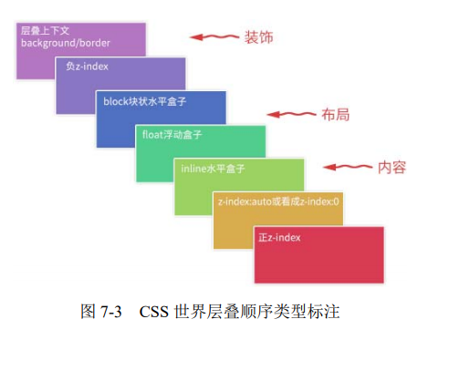

# css层叠

z-index只有与position不是static的元素在一起时，才起一定作用

但是css3并非支队定位元素有效，flex盒子的子元素也可设置z-index属性。

层叠的规则:
1. 谁大谁在上
2. 相同时，后来者居上

层叠上下文特性
1. 层叠上下文层叠水平 比 普通元素要高
2. 层叠上下文可以阻断元素的混合模式
3. 层叠上下文可以嵌套，内部的层叠上下文受制于外部的。
4. 每个层叠上下文里和兄弟元素是独立的；层叠变化或者渲染时，只需要考虑后代的元素
5. 每个层叠上下文时自成体系的，当元素发生层叠时，整个元素被人误在浮层；

层叠上下文的创建 stacking context也是由一些特殊的css属性创建的。
分为三类，他们也是有一些特性的css属性创建的
1. 天生就是，比如页面的根元素，成为根层叠上下文。
2. 正统的，z-index值为数值的定位元素的传统 层叠上下文。（这里的数值包含**0 正负数**）
3. 扩展的 其他css3属性。

根层叠上下文：
  1. 可以理解为 <html>元素，因此页面里所有元素一定至少都在一个层叠结界中。
  2. 定位元素和传统层上下层叠文： 对于position时relative absolute以及firefox/ie下含有position为fixed的定位元素，当z-index不是auto时，就会创建层叠上下文。

css3时代的层叠上下文：
1. 元素为flex布局元素（父元素display：flex\inline-flex），
opcaity只要不是1，那么就是具备z-index为auto的级别能力。

当变为层叠上下文也就是stacking context后，层叠顺序会变高。
具体的位置、级别在：
1. 如果层叠上下文不依赖z-index数值，那么器层叠顺序就是z-index:auto，可以看成z-index：0级别。
2. 如果是依赖了zindex数值，那么就由数值决定。

z-index负值的好处：
1. 可访问性隐藏 seo。只需要比该元素高的元素设置一个背景色即可。
可clip相比，优势在于元素不用绝对定位，利用position relative即可。
另一个优势为普适性更强。

2. IE8下多背景模拟
多层背景更加的层次感。

z-index不犯二准则：
1. 对于非浮层元素 避免设置z-index的值，且z-index的值没有超过2的道理。

避免因为设置了巨大的zindex无法覆盖的问题，层级够多了。
避免一山比一山高 的设置问题。

但该准则不适用于哪些飘来飘去的元素、弹窗、错误提醒等

